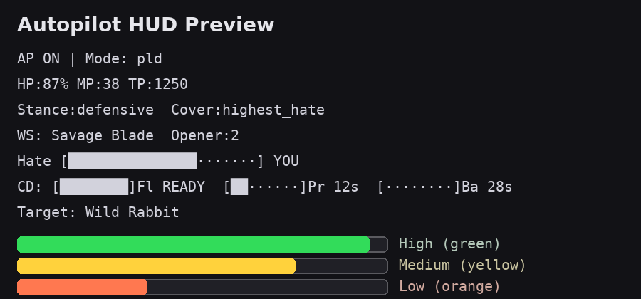

# ffxi-autopilot-windower

[](LICENSE)
[](#)
[](#)
[](#)
[](https://github.com/<YOUR_GH_USERNAME>/ffxi-autopilot-windower/issues)
[](#)

Helper to automate follow/assist/heal and a PLD/WAR tank loop on **private** FFXI servers.
Includes a colorized HUD (hate bar + per-action cooldown timers).

> ⚠️ Use only on private servers you own/control. Automation on retail FFXI can violate ToS.

## HUD Preview



## Install
1. Download this repo or the release zip and extract.
2. Copy the `autopilot/` folder into your Windower `addons/` directory, so you have:
   `Windower/addons/autopilot/init.lua`.
3. In-game: `//lua load autopilot`

## Commands (short list)
```
start, stop, mode <assist|heal|follow|pld>,
leader <Name>, ws <Name|auto>, tp <N>, follow <on|off>,
stance <defensive|offensive|auto>, war <on|off>,
covermode <highest|healer|leader>, coverstep <on|off>,
hud <on|off>, hudpos <x> <y>, hudsize <n>,
hudcolor <on|off>, hudcd <on|off>,
hudbarwidth <n>, hudcdwidth <n>,
smooth <on|off>, smoothdelay <move> <target>,
status
```

## Recommended repository name
**ffxi-autopilot-windower**

After you create the GitHub repo, replace the badge placeholders:
- Find `<YOUR_GH_USERNAME>` and replace with your GitHub username.
- The badges will then point to the real issues/releases/downloads.

## Releases
- Tag your commit, e.g. `v0.1.0`, and push the tag. The included GitHub Action will zip `autopilot/` and attach it to the release.
